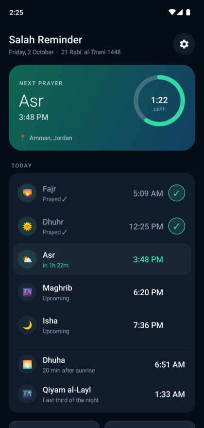
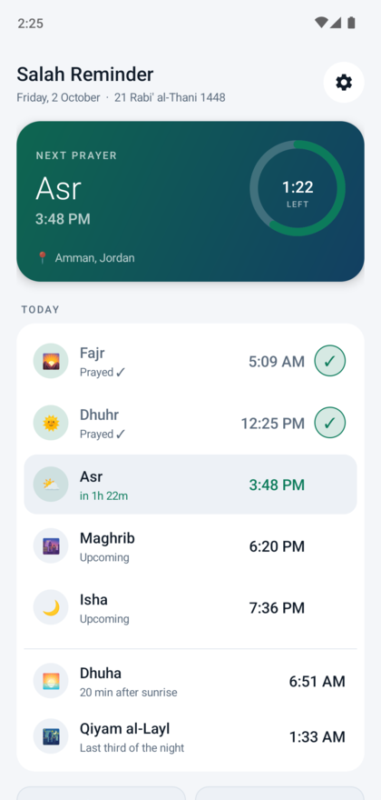
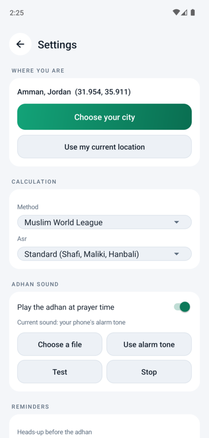
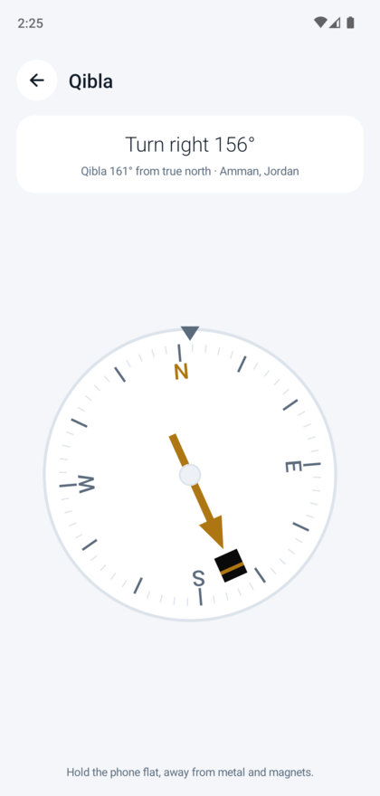
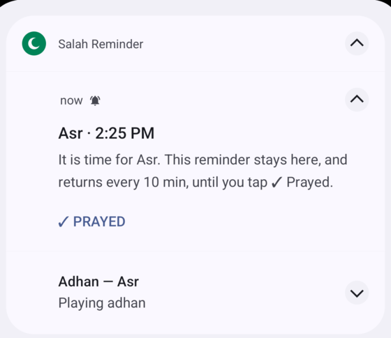

# Salah Reminder

An offline Android app for the five daily prayers: it works out the times where you are,
plays your own adhan, and keeps a reminder pinned in the notification panel until you
confirm you've prayed.

**[⬇ Download the latest APK](../../releases/latest/download/SalahReminder.apk)**

## What it looks like

| Home (dark) | Home (light) | Settings | Qibla |
| :---: | :---: | :---: | :---: |
|  |  |  |  |

And the reminder that stays in the notification panel until you confirm:



## What it does

- **Prayer times on your phone** — computed from the sun's position, no internet needed
  once your location is set.
- **Pick your city from a list** — 34,000 cities are bundled with the app. Tap your country,
  tap your city, done. No typing and no internet; GPS and coordinates still work too.
- **An adhan in the box** — a full adhan ships with the app and plays at the phone's *alarm*
  volume. Prefer another? Point it at any audio file on your phone.
- **Heads-up before the adhan** — "Asr in 10 min", with the minutes you choose (or off).
- **A reminder you can't swipe away** — the card stays until you tap **✓ Prayed**, and
  comes straight back if your phone dismisses it.
- **Confirm it in the app too** — tap the **✓** beside any prayer that has already passed,
  even if you never saw the notification. Tap it again to undo a mis-tap.
- **Repeat nagging** — it reminds you again every few minutes until you confirm.
- **Qibla compass** — "turn left / turn right", turning green and buzzing when you're facing Makkah.
- **Works at any latitude** — where the sun doesn't rise or set at all, it takes the timetable
  of the nearest day that does have a real sunrise and sunset (*aqrab al-ayyam*), so the Arctic
  gets sane times instead of midnight.
- **Qiyam al-Layl** — an optional night-prayer reminder at the last third of the night, the
  middle of the night, or however long before Fajr you choose.
- **Dhuha** — an optional forenoon reminder, a set time after sunrise or at mid-morning.
- **Taqabbal Allahu minna wa minkum** — shown when you mark a prayer done.
- **Tells you when there's a new version** — a quiet notification when one appears, without
  waiting for you to open the app. Tap it and the build downloads in the background; a second
  notice says when it's ready and goes straight to Android's installer. There's a banner on the
  home screen too. No store, no sideloading dance.
- **Light, dark, or whatever your phone is set to** — your choice, in Settings.
- **Survives** reboots, app updates, and time-zone changes.

## The screens

**Home** — the next prayer with a live countdown ring, today's five times with their state
(upcoming, waiting for you, passed, prayed), the Gregorian and Hijri date, and a warning banner
if anything on your phone could delay the adhan. Each passed prayer carries a **✓** you can tap
to confirm you prayed it, and tap again to undo.

**Choose your city** — a country list, then the cities in it, biggest first. A filter box is
there if you would rather type.

**Settings** — location, calculation method, Asr school, adhan sound, reminder timings, the
optional Dhuha and Qiyam reminders, the theme, and the reliability switches. Everything saves
the moment you change it; there is no Save button.

**Qibla** — a compass dial with a gold needle pointing at the Kaaba.

## Install

1. Open the download link above on your phone and tap the APK.
2. Allow "Install unknown apps" for your browser when Android asks.

After that first install, the app updates itself: it checks for new releases, shows
**"Version x.y.z is available"** on the home screen, and tapping it downloads and installs.
There is also **Settings → App → Check for updates now**.

Every push to `main` builds a signed APK and publishes it as a release, so the download link
always gives the newest version.

## First-time setup

1. Open the app and allow notifications.
2. Tap **⚙ Settings → Search** your city (or **Use my current location**).
3. Choose your **method** and **Asr** school if the defaults aren't yours.
4. **Adhan sound → Choose a file** → pick your adhan, then **▶ Test** to hear it.
5. Pick the **heads-up** and **repeat** minutes.
6. Tap **Allow background running** — this matters on Samsung, Xiaomi, Oppo and Huawei,
   which otherwise stop the reminders.
7. **Test a full reminder now** to see the whole flow once.

You don't need to leave the app running. Android wakes it at each prayer time; between
times it does nothing and uses no battery.

## Signing

Builds are signed with a fixed key held in GitHub Actions secrets (`KEYSTORE_B64`,
`KEYSTORE_PASSWORD`, `KEY_ALIAS`, `KEY_PASSWORD`), so each release installs as an update over
the last one. Without that the key would differ every build and Android would reject the
update as a signature mismatch.

For local builds, put the same key in `keystore.jks` with a `keystore.properties` beside it:

```
storeFile=keystore.jks
storePassword=...
keyAlias=salah
keyPassword=...
```

Both files are git-ignored and must stay that way. With no keystore present the build still
works — it falls back to a throwaway debug key, which is fine for trying things out but will
not install over a release build.

## Running it locally (no Android Studio)

`scripts/dev.sh` fetches its own JDK 17, Gradle and Android SDK into `.toolchain/`
(git-ignored, nothing installed system-wide) and installs straight onto a plugged-in phone:

```sh
./scripts/dev.sh emulator   # open a simulated phone on this computer, app installed
./scripts/dev.sh install    # build + install + launch on a plugged-in phone
./scripts/dev.sh build      # -> app/build/outputs/apk/debug/app-debug.apk
./scripts/dev.sh logs       # follow the app's logcat
./scripts/dev.sh stop       # close the emulator
```

An Android app is not served over localhost like a website — it needs a phone, real or
simulated. `emulator` gives you the simulated one in a window you can click; the first run
fetches the emulator and an Android 14 image (~1.5 GB, once).

For `install`, turn on **Developer options → USB debugging** on the phone and tap *Allow*
when it asks. For wireless, use **Wireless debugging** and
`.toolchain/sdk/platform-tools/adb pair <ip>:<port>`.

With your own SDK already installed, plain Gradle works as well:

```sh
echo "sdk.dir=/path/to/android-sdk" > local.properties
gradle assembleDebug
gradle testDebugUnitTest   # PrayerCalc's unit tests, also run on every CI build
```

There is no Gradle wrapper on purpose: CI pins Gradle 8.9 and `scripts/dev.sh` fetches its own
8.9 plus a JDK 17, so a committed `gradlew` would only add a third version to disagree with.

No third-party libraries — the whole app is the Android framework plus the files in
`app/src/main/java/com/salah/reminder/`:

| File | Role |
| --- | --- |
| `MainActivity` | home dashboard |
| `SettingsActivity` | all configuration |
| `QiblaActivity` | compass |
| `Ui` | colours, type and the shared view builders |
| `ThemedActivity` | applies the light/dark choice before a screen is built |
| `PrayerCalc` | astronomy: prayer times and Qibla bearing |
| `Scheduler` | alarms, state and notifications |
| `AdhanService` | plays the adhan |
| `AlarmReceiver` / `BootReceiver` | alarm delivery and restoring after reboot |
| `CityPickerActivity` | the bundled city list |
| `Updater` | checks GitHub releases, downloads and installs |
| `HijriDate` | Hijri date from the platform calendar |

Tests live in `app/src/test/` and cover `PrayerCalc`: prayer-time ordering, Dhuhr at solar noon,
Umm al-Qura's fixed 90-minute Isha, a later Hanafi Asr, daylight-saving handling, Qibla bearings
checked against exact geometry, and every month at Tromsø, Longyearbyen, Alert and McMurdo so the
polar fallbacks keep working.

City data: [GeoNames](https://www.geonames.org/) (`cities15000`, places over 15,000 people),
licensed [CC BY 4.0](https://creativecommons.org/licenses/by/4.0/), bundled as
`app/src/main/assets/cities.txt`.
